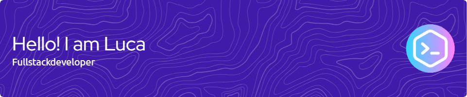

<h1>👋 Hi, I'm Luca</h1>

👨‍💻 Full-stack developer with a curiosity for <strong>cybersecurity</strong> and <strong>modern web tech</strong>. 
📺 I share technical content on TikTok, YouTube, and X  
📍 You can find me at <a href="mailto:luca.baeyens@icloud.com">luca.baeyens@icloud.com</a>

<h2>⚙️ What I work with</h2>
<ul>
  <li><code>JavaScript</code>, <code>Python</code>, <code>C</code>, <code>Python</code>, <code>SQL</code></li>
  <li>Frontend: <strong>ReactJS</strong>, <strong>TailwindCSS</strong></li>
  <li>Backend: <strong>Django</strong>, <strong>PostgreSQL</strong>, <strong>REST APIs</strong></li>
  <li>Python/C Scripting</li>
  <li>Web security: <strong>XSS</strong>, <strong>CSRF</strong>, <strong>auth flaws</strong>, etc.</li>
  <li>APIs: <strong>Stripe Payments</strong>, etc.</li>
</ul>

<h2>📦 Projects</h2>
<ul>
  <li><strong><a href="https://autonomia.pages.dev">Autonomia</a></strong>: A SaaS that let's non-technical users automate their tasks with a Drag and Drop editor, powered by Python. It allows tasks like: talking to local AIs, reading spreadsheets, making requests, moving your mouse and typing on your keyboard, etc.</li>
  <li><strong><a href="https://djangoquickie.pages.dev">DjangoQuickie</a></strong>: A boilerplate/starter kit for spinning up small Django projects fast. Useful for quick tests, MVPs, or demos with sensible defaults.</li>
</ul>
